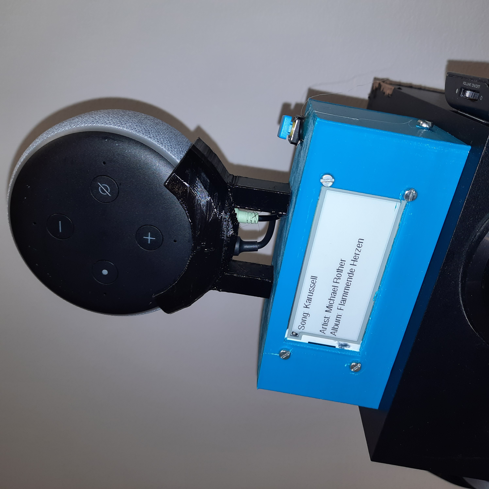
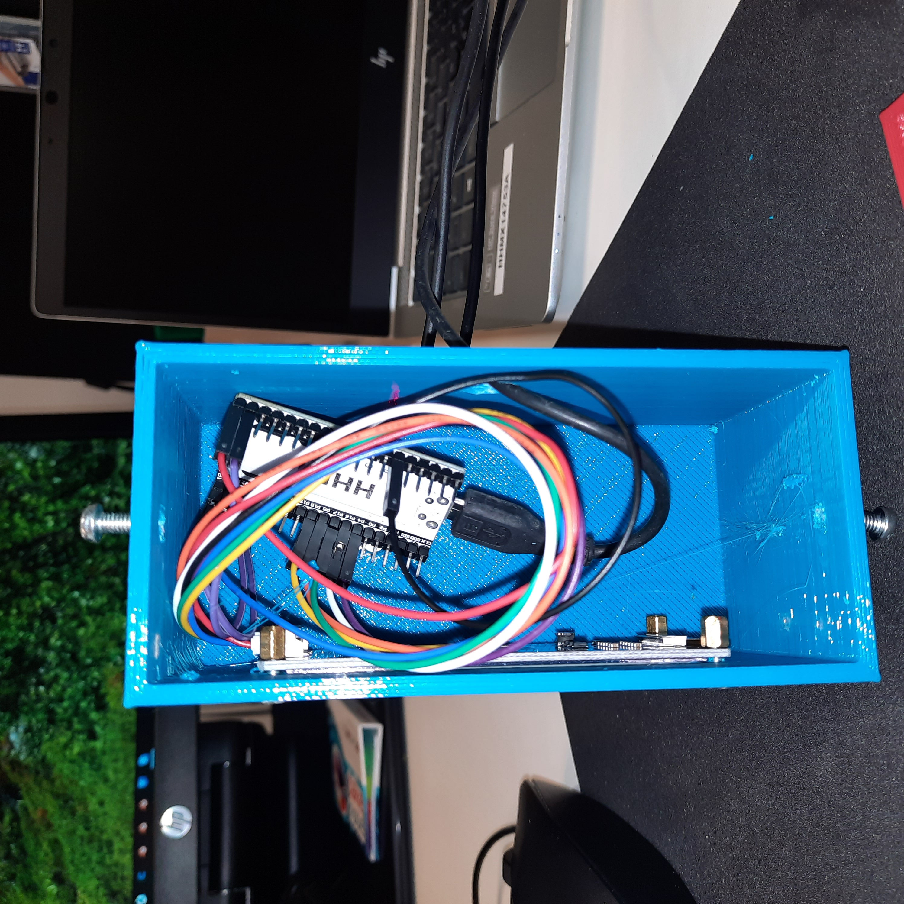
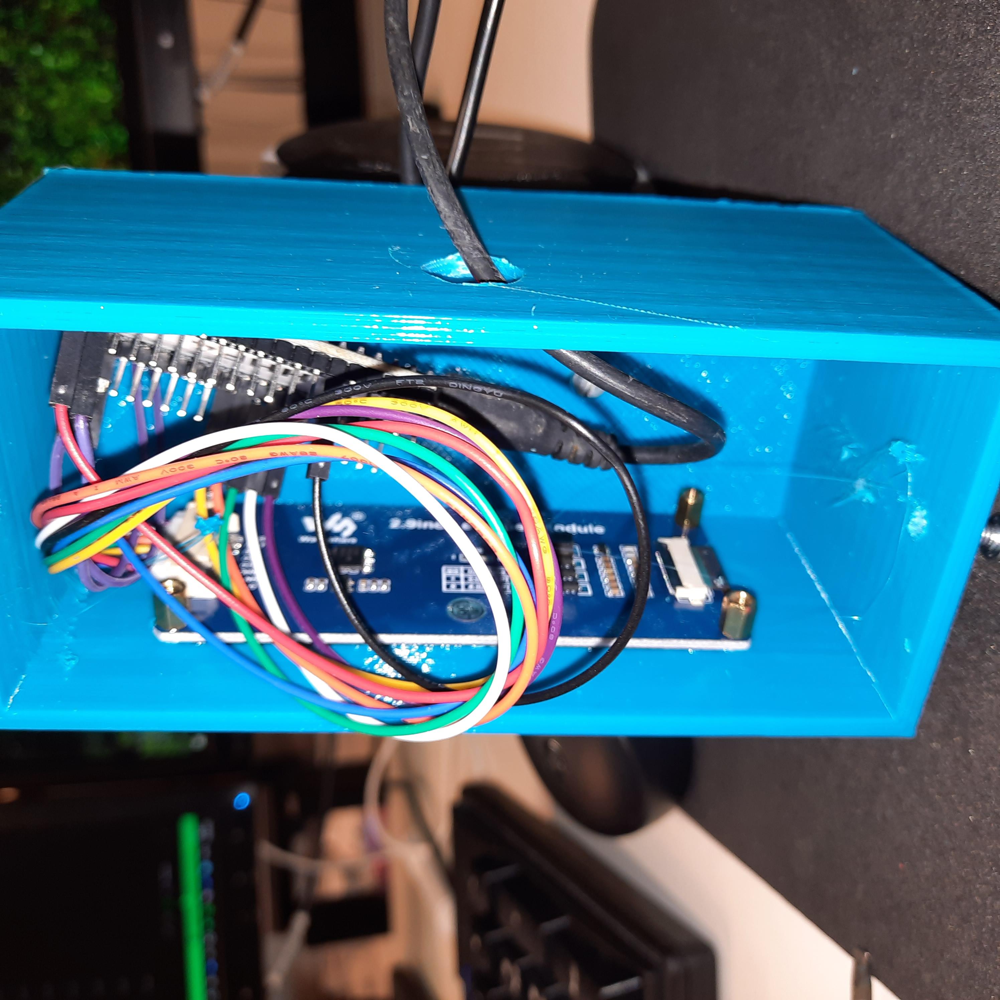
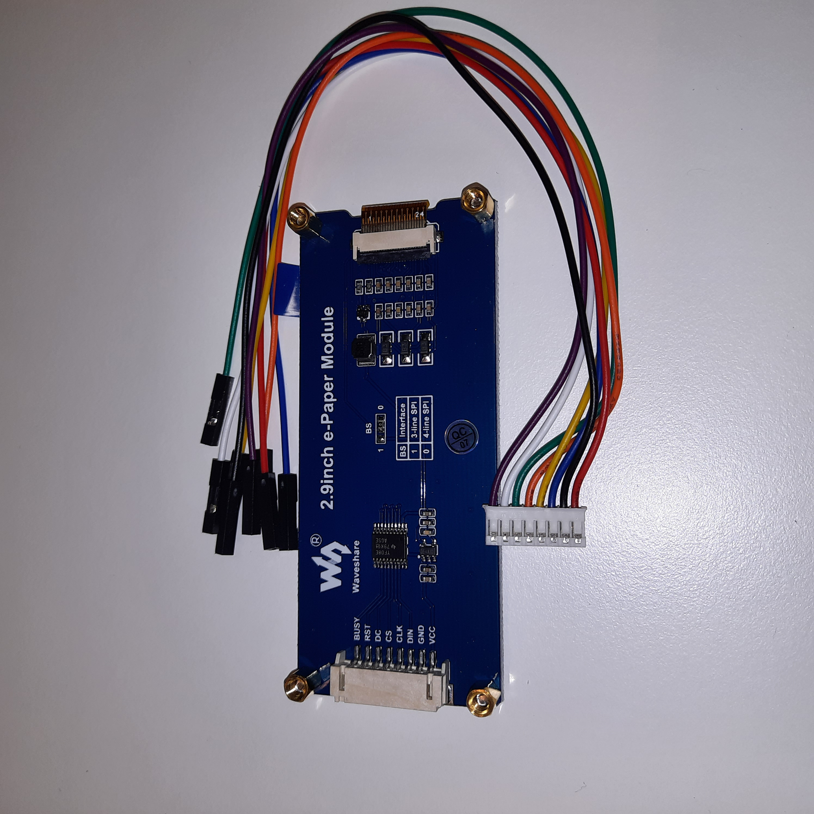
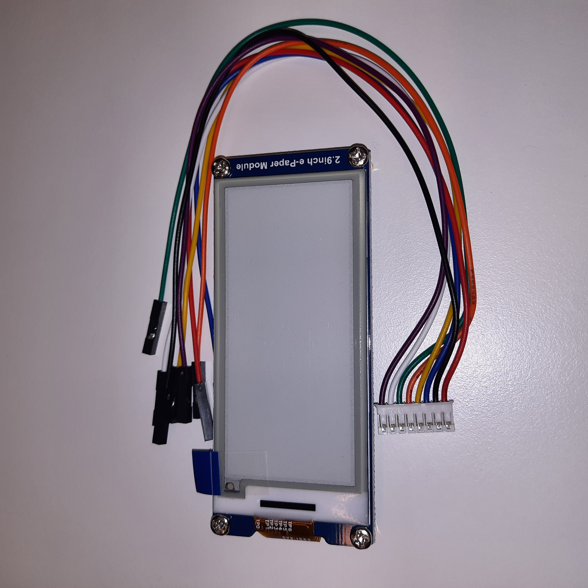
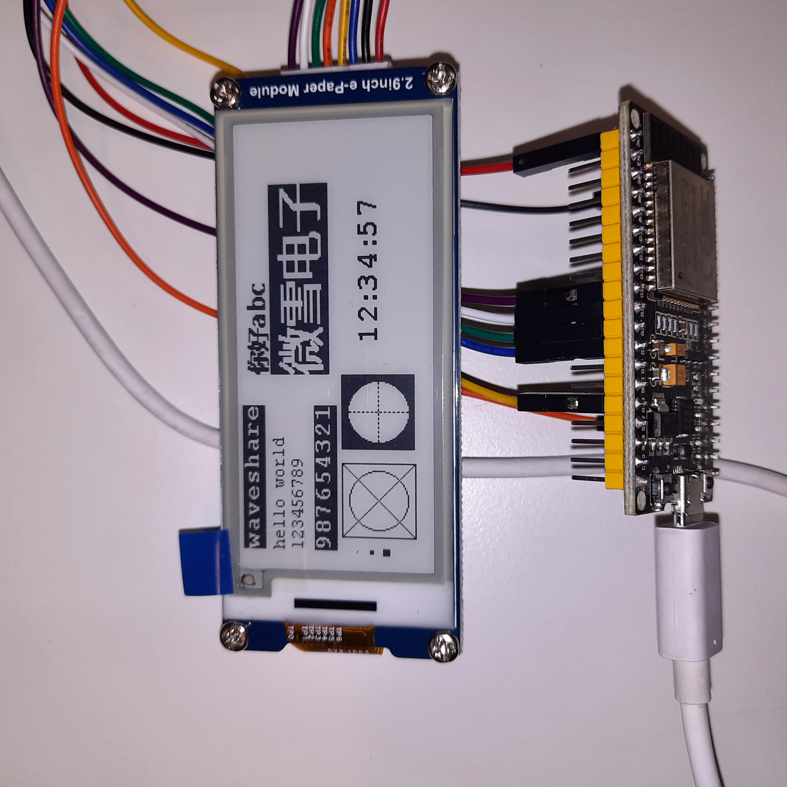

# Spotify Song Display

How to show the song on Spotify with ESP32 and e-paper display

Building instructions are available on my blog, https://www.sabulo.com/sb/3d-printing-2/spotify-song-display-with-esp32-and-e-paper-display/

Code and STL file for printing a box and a stand for the Amazon Echo Dot 
included here on Github

https://youtube.com/shorts/mzyZR241rJw?feature=share

